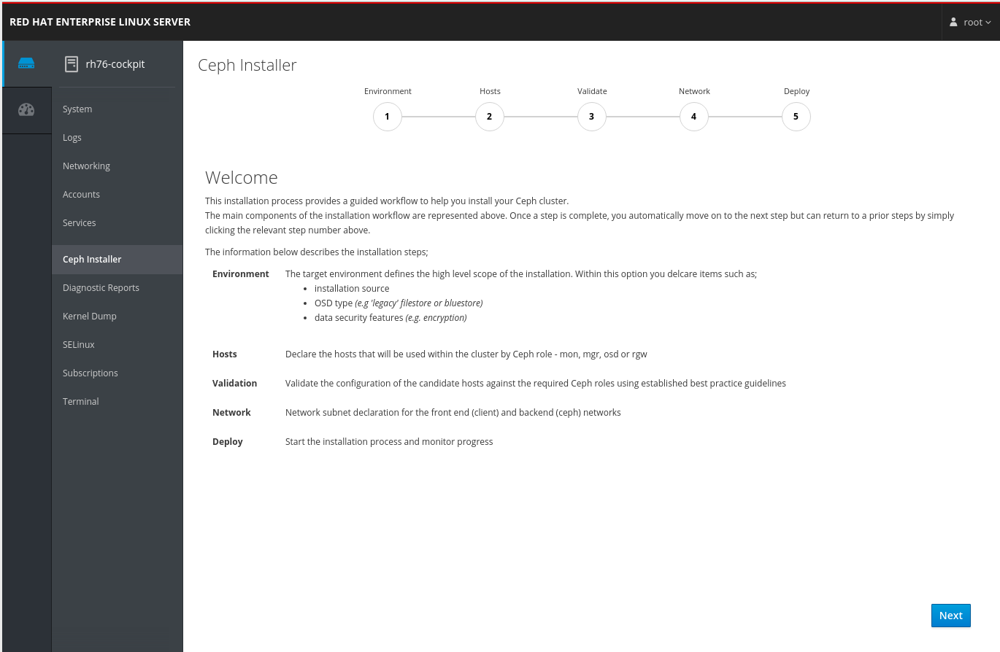

# cockpit-ceph-installer
This project aims to provide a simple means to deploy a Ceph cluster by 'teaming up' with the ansible-runner and runner-service projects. The goal is to use the cockpit UI to gather all the settings necessary to drive a ceph-ansible playbook to install your Ceph cluster. It also uses the ceph-check-role ansible module to handle the validation of role against host configuration.

## Project Status
The plugin currently will 
- create the ansible inventory file (hosts and groups)
- probe and validate candidate hosts against their intended Ceph role
- presents available networks for the public and cluster networks required by Ceph

### What's left?
1. The UI gathers the variables for ceph-ansible's site.yml, so these variables need to be committed to the filesystem
2. The deploy page needs to be completes to run the site.yml playbook and poll the runner-service for progress updates

## Curious, take a look...

[](https://youtu.be/6_RSUZzF2SA) 

## Take it for a testdrive
### 1. Create a test VM
  #### **Fedora 29** *(example uses a cloud qcow2 image)* ####
  1. As root run the following commands to install pre-requisite packages
```bash
dnf install -y wget git cockpit-ws cockpit-bridge cockpit-system cockpit-dashboard ansible python python3-pyOpenSSL python3-jwt python3-flask python3-flask-restful
pip3 install ansible_runner
```

#### **RHEL7** *(example uses a RHEL7.6 cloud image)*   ####
1. Enable the following CDN repos *(ose 3.9 required for python-jwt)*
```
subscription-manager repos --enable=rhel-7-server-rpms --enable=rhel-7-server-extras-rpms --enable=rhel-7-server-optional-rpms --enable=rhel-7-server-ansible-2-rpms --enable=rhel-7-server-ose-3.9-rpms
```  

  2. Enable **EPEL** *(required for python-flask-restful)*
```
yum install -y https://dl.fedoraproject.org/pub/epel/epel-release-latest-7.noarch.rpm
```

  3. Install pre-requisite packages
```
yum install -y
    ansible  
    pyOpenSSL  
    python-flask  
    python-jwt  
    git  
    unzip  
    wget  
    python2-flask-restful  
    python2-pip (for up to date runner install)  
    python2-docutils  
pip install ansible_runner  
```

### 2. Enable the cockpit interface
```
systemctl enable --now cockpit.socket  
```
NB the install of python provides a python2 environment and sets up /usr/bin/python, which ceph-check-role uses

### 3. Install the ansible-runner-service  

  1. create a config dir (```mkdir /etc/ansible-runner-service```)
  2. As root, 
  ```
  cd ~
  git clone https://github.com/pcuzner/ansible-runner-service.git
  cd ansible-runner-service
  python ansible_runner_service.py
  ```
  3. ansible_runner_service will create a file called ```svctoken``` in the current directory. copy this file to ```/etc/ansible-runner-service``` (this is where cockpit expects to pick it up!)
  4. install the checkrole playbook and module
  ```
    mkdir samples/project/library
    cd samples/project/library && wget https://raw.githubusercontent.com/pcuzner/ceph-check-role/master/library/ceph_check_role.py
    cd .. && wget https://raw.githubusercontent.com/pcuzner/ceph-check-role/master/checkrole.yml
  ```
  5. Update the playbook (the defaults need to be removed so the cockpit plugin can drive the checks). Update the ```checkrole.yml``` playbook as follows;
  - delete the vars definition (4 lines)
  - update the declarations for mode and deployment;  
  ```
          mode: "{{ mode }}"  
          deployment: "{{ deployment }}"  
  ```

### 4. Define some example ssh access

  - add multiple entries to /etc/hosts to represent hosts all pointing to 127.0.0.1
  - runner-service will create ssh keys in samples/env. Use ```ssh-copy-id -f -i ssh_key.pub root@<host>``` to copy the public key to your test hosts.

### 5. Deploy the cockpit plugin

1. create cockpit directory in root's home folder
```
cd ~
mkdir -p .local/share/cockpit
```
2. grab the dist folder from the project
3. add a symlink to the dist folder in your ceph-installer directory
```
cd /root/.local/share/cockpit
ln -s ~/ceph-installer/dist/ ceph-installer
```
4. point your browser at port 9090 of the machine, and login as root
   - make sure runner-service has been started!

### Gotcha's
1. if you see "Problem fetching group listnot-found" in the browsers console..
   - check that runner-service is running!


-----------------------------------------------------------------------------------------------------------------

Hack on it

To develop you need more than the dist and src - you'll need the cockpit dev environment.
More steps to come.

