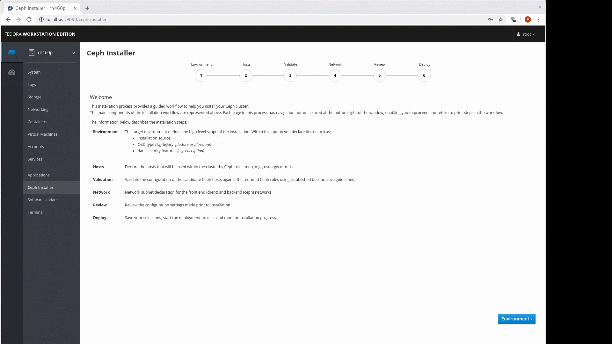

# cockpit-ceph-installer
This project aims to provide a simple means to deploy a Ceph cluster by 'teaming up' with the [ansible-runner](https://github.com/ansible/ansible-runner) and [ansible-runner-service](https://github.com/ansible/ansible-runner-service) projects. It uses the cockpit UI to validate the intended hosts are suitable for Ceph, and drive the complete ansible installation using [ceph-ansible.](https://github.com/ceph/ceph-ansible)

## Project Status
The plugin currently
- supports different Ceph versions, bluestore and filestore, encrypted/non-encrypted
- for a Nautilus target, a separate metrics hosts is *required*. This host provides full prometheus/grafana integration for the Ceph UI (dashboard)
- probes and validates candidate hosts against their intended Ceph role(s)
- presents available networks for the public, cluster, S3 and iSCSI networks
- provides a review of the selections made
- configuration options selected are committed to standard yml format ansible files (host & group vars)
- initiates the ceph-ansible playbook and monitors progress
- any deployment errors are shown in the UI
- following a Nautilus based deployment, the user may click a link to go straight to Ceph's web management console
- allows environment defaults to be overridden from `/var/lib/cockpit/ceph-installer/defaults.json`
- supported roles: mons (inc mgrs), mds, osds, rgws and iscsi gateways, metrics
- support for All-in-One installs for POC (aka "kick-the-tyre" tests)
- creates log of all the settings detected and requested at `~/cockpit-ceph-installer.log`
- supports deployment with and without firewall enabled
- supports container access through Red Hat's authenticated registry (ISO, and Red Hat deployment options)

### Known Issues
1. An ISO based deployment may not install the ceph-grafana-dashboards rpm
2. On slow links the podman/docker pull could hit the default timeout of 300s, resulting in a failed deployment. If this occurs, consider downloading the required containers manually and click 'Retry'  

## Curious, take a look...

[](https://youtu.be/wIw7RjHPhzs)

**Important note**: be sure to disable any AD blocker extension in your browser.

## Take it for a testdrive
In this example we'll assume that you have a test VM ready to act as an ansible controller, and a set of VMs that you want to install Ceph to. Remember to ensure that the machines can each resolve here names (/etc/hosts will be fine!) All the commands need system privileges, so you'll need root or a sudo enabled account (I'm assuming root in these example steps).
### 1. Configure the pre-requisites
#### **Fedora 28/29/30**
1.1 As root run the following commands to install pre-requisite packages
```
# dnf install docker cockpit-ws cockpit-bridge git 
```

#### **RHEL7**
  * Install pre-requisite packages
```
# yum install -y docker cockpit-ws cockpit-bridge git 
```

### **CentOS 7**
* As root run the following commands to install pre-requisite packages
```
# yum install -y docker cockpit git 
```

1.2 Enable and start docker daemon (unless your using podman!)
```
# systemctl enable docker.service
# systemctl start docker.service
```
1.3 If your installation target(s) use names, ensure name resolution is working either through DNS or /etc/hosts

### 2. Install ceph-ansible from the Ceph project
2.1 Install python-notario (required by ceph-ansible)  
2.2 Pull ceph-ansible from github (you'll need the latest stable-4.0 branch, or master)  
```
# cd /usr/share
# git clone https://github.com/ceph/ceph-ansible.git
```
2.3 Make the installation playbooks available to the runner-service  
```
# cd ceph-ansible
# cp site.yml.sample site.yml
# cp site-container.yml.sample site-container.yml
```  

### 3. Install the cockpit plugin
3.1 Get the cockpit plugin src  
```
# cd ~
# sudo git clone https://github.com/red-hat-storage/cockpit-ceph-installer.git
# cd cockpit-ceph-installer
```

3.2. Add a symlink to the dist folder of your cockpit-ceph-installer directory
```
# ln -snf ~/cockpit-ceph-installer/dist /usr/share/cockpit/cockpit-ceph-installer
# systemctl restart cockpit.socket
```
3.3 From the root of the cockpit-ceph-installer directory, copy the checkrole components over to ceph-ansible's working directory
```
# cp utils/ansible/checkrole.yml /usr/share/ceph-ansible
# cp utils/ansible/library/ceph_check_role.py /usr/share/ceph-ansible/library/.
```
  
### 4. Start the ansible API (ansible-runner-service)
Although the ansible-runner-service runs as a container, it's configuration and playbooks come from the host filesystem.

4.1 As the **root** user, switch to the projects ``utils`` folder. 
```
# cd utils
# ./ansible-runner-service.sh -s -v
```
NB. This script wil create and configure missing directories, set up default (self-signed) SSL identities, and download the runner-service container.  

4.2 Once the runner-service is running you'll be presented with a URL to use to connect to GUI installer. Login as the root user.
  
## SUDO Support
The installer can be run under root *or* through a passwordless sudo user account. To use a sudo based account you'll need to perform the following additional steps;  

1. Create your deployment account on **each** host (ansible, and Ceph nodes). This example uses an account named cephansible.  
```
groupadd cephansible
useradd cephansible -g cephansible
echo -e "cephansible\tALL=(root)\tNOPASSWD:ALL" > /etc/sudoers.d/cephansible
passwd cephansible
```
2. Update /etc/ansible-runner-service/config.yaml with 
```
target_user: cephansible
``` 
3. Start the ansible-runner-service.sh script with sudo (if your using an authenticated registry, you'll also need to ```sudo podman login...``` first!)
4. Login to the cockpit UI with you sudo account. On the login screen, **you must 'tick' the checkbox** for "Reuse my password for privileged tasks".  
  
When you start the ansible-runner-service.sh under sudo, the script uses this account to take ownership of cert files, and defines this account as the target user for the ansible-runner-service API interactions by defining an override in ```/etc/ansible-runner-service/config.yaml```.

With sudo, you will also need to consider SELINUX. The group_vars and host_vars directories in usr/share/ceph-ansible need to be accessible from the 
container, so ensure these directories have a SELINUX context of container_file_t.  

&nbsp;  
## Overiding Defaults
The cockpit installer uses containers for the runner-service and at least the monitoring stack (metrics role). If you need to use images from  
non-default locations, follow these steps.
1. To use a different container for the runner-service, prefix the script with the CONTAINER_IMAGE_NAME parameter. e.g.
```
CONTAINER_IMAGE_NAME='rhceph-beta/ansible-runner-rhel8:latest' ./ansible-runner-service.sh -s -v
```
<small>this will use the beta version of the ansible-runner-service container</small>

2. Before launching the cockpit UI, you may override defaults applied to the UI and ceph-ansible yaml. This is useful for QE type testing. To define the overrides, create a file in `/var/lib/cockpit/ceph-installer/defaults.json`. In the example content below, the default Red Hat image for the ceph container is overridden.
```json
{
  "rhcs_ceph_image": "rhceph-beta/rhceph-4-rhel8"
}
```
Note that these overrides are not currently validated, so changing from the defaults voids your warranty :)

The table below shows the variables that can be overridden using this mechanism.
  
| Setting | Used by | Options/Defaults |
| --- | --- | --- |
|sourceType| UI | **"Red Hat"**, "OS Distribution", "Community"|
|targetVersion| UI | **"RHCS 4"**|
|clusterType| UI | **"Production"**, "Development/POC"|
|installType| UI | **"Container"**, "RPM"|
|osdType| UI | **"BlueStore"**, "FileStore"|
|osdMode| UI | **"None"**, "Encrypted" |
|flashUsage| UI | **"Journals/Logs"**, "OSD Data"|
|firewall| UI/ceph-ansible| **true**, false|
|rhcs_node_exporter_image| ceph-ansible | "registry.redhat.io/openshift4/ose-prometheus-node-exporter:v4.1"|
|rhcs_grafana_image| ceph-ansible | "registry.redhat.io/rhceph/rhceph-3-dashboard-rhel7:3"|
|rhcs_prometheus_image | ceph-ansible | "registry.redhat.io/openshift4/ose-prometheus:4.1"|
|rhcs_alertmanager_image | ceph-ansible | "registry.redhat.io/openshift4/ose-prometheus-alertmanager:4.1"|
|rhcs_ceph_image| ceph-ansible | "rhceph/rhceph-4-rhel8"|

&nbsp;

-----------------------------------------------------------------------------------------------------------------

## Hack on it

To hack on the UI plugin, you'll need a nodejs install for ReactJS and a cockpit environment. Take a look at the
[dev guide](DEVGUIDE.md) for instructions covering how to set things up.

For background, take a look at the great starter kit [docs](https://github.com/cockpit-project/starter-kit) that the cockpit devs have produced.
